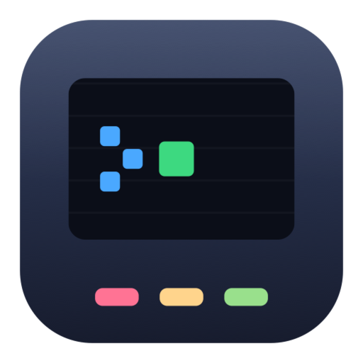
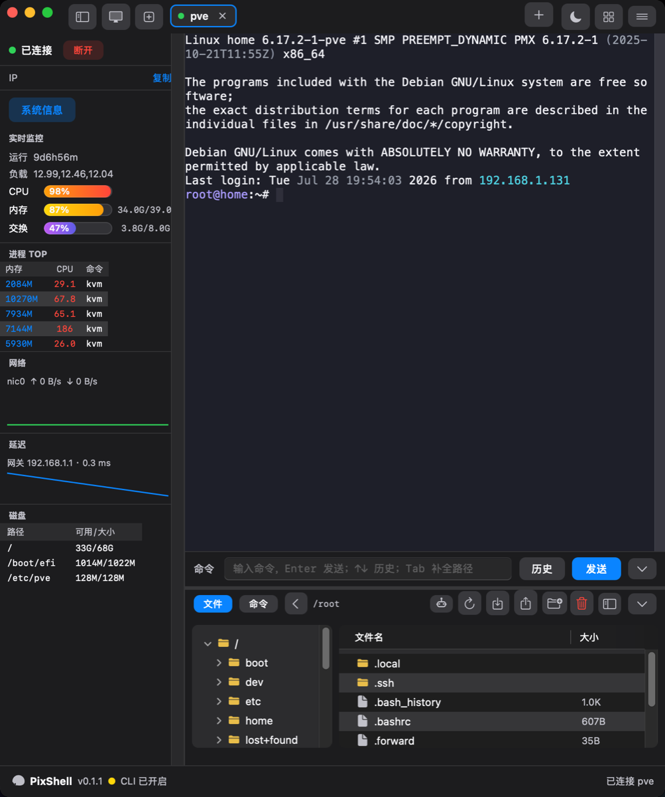
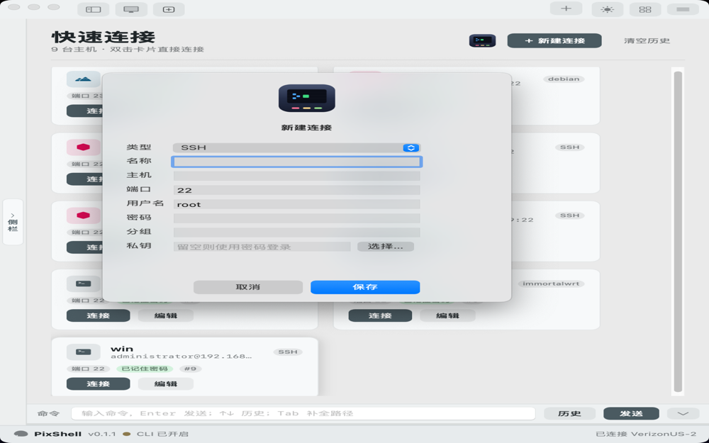
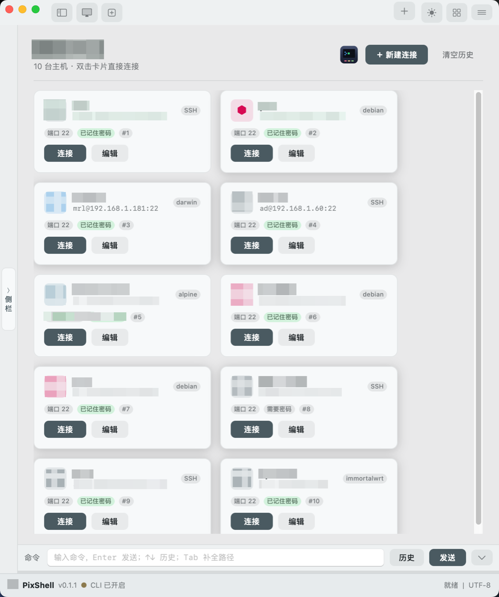
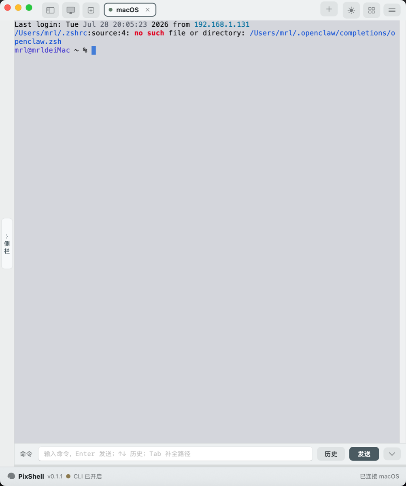
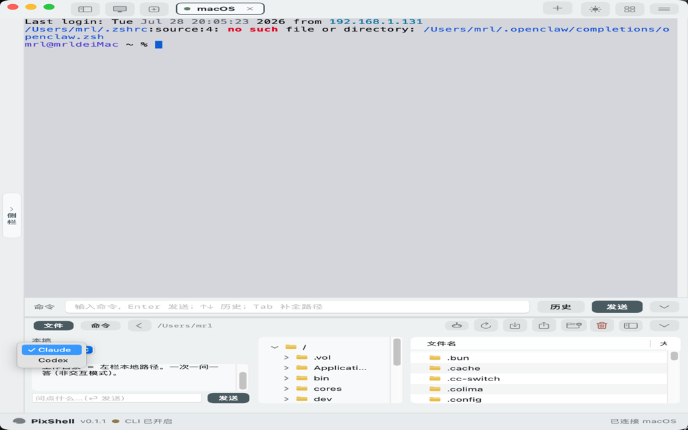
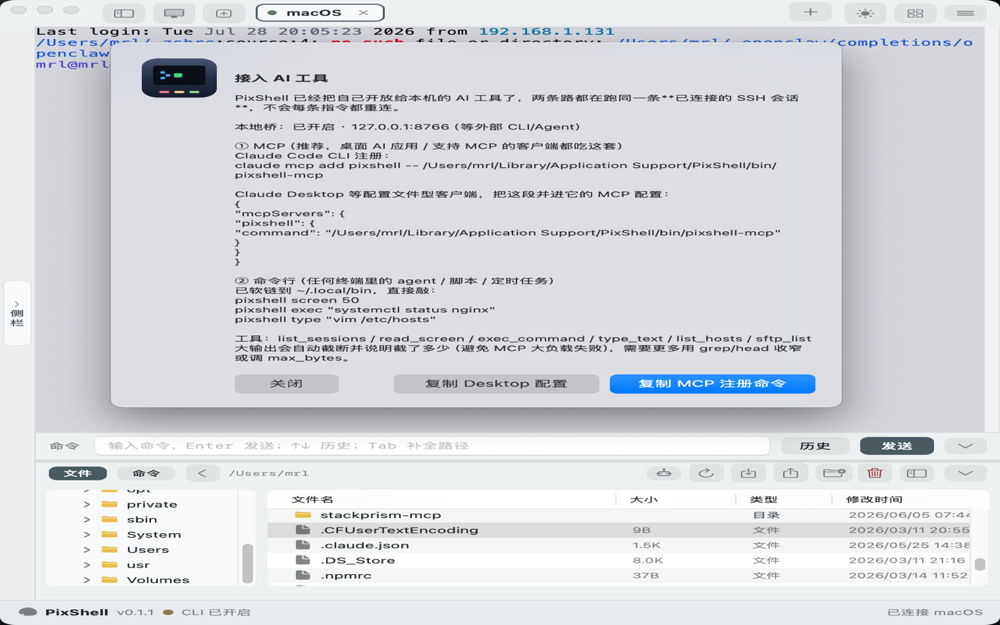
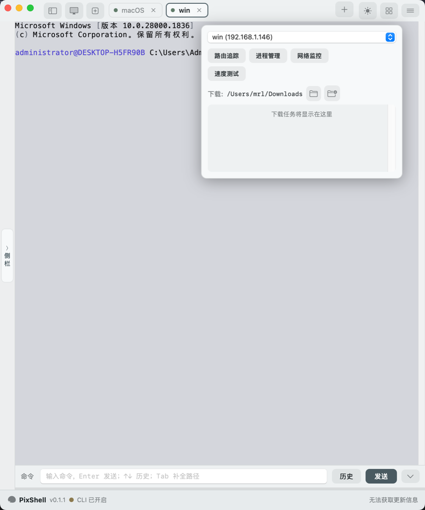
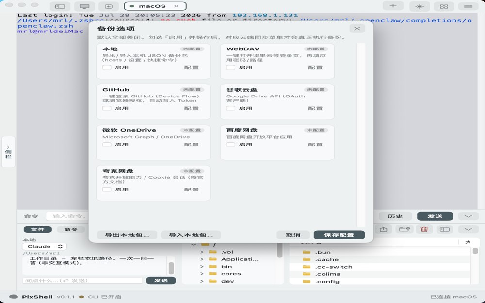
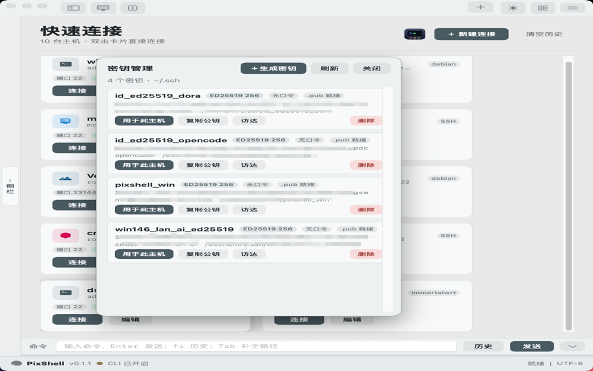

<div align="center">


[](https://github.com/lyu0805/pixshell)
[](https://github.com/lyu0805/pixshell)
[](./mac)
[](./win)



[中文](./README_CN.md)

**Native SSH / SFTP client for macOS and Windows**

</div>

---

PixShell is a desktop SSH / SFTP client built as two native applications in a single monorepo.

| Platform | UI | Terminal | SSH |
| --- | --- | --- | --- |
| macOS | Swift / AppKit | SwiftTerm | SwiftNIO |
| Windows | C# WPF | WebView2 + xterm.js | SSH.NET |

## Screenshots

| Dark theme | Light theme |
| :---: | :---: |
|  |  |

| Connection manager | New connection |
| :---: | :---: |
|  |  |

| Quick connect history | Sidebar collapsed |
| :---: | :---: |
|  |  |

| AI tool integration | MCP / CLI bridge |
| :---: | :---: |
|  |  |

| Text editor | Download manager |
| :---: | :---: |
|  |  |

| Cloud backup | Key manager |
| :---: | :---: |
|  |  |

## Features

- Tabbed SSH sessions with PTY resize and reconnect
- Connection manager with groups, notes, and host OS detection
- Password and private key authentication with encrypted local storage
- SFTP file browser: upload, download, pack transfer, remote text editing, file permissions
- Light and dark UI themes with configurable terminal color palettes
- SOCKS and HTTP proxy support on both platforms
- Local automation bridge (HTTP API) for CLI and AI agent workflows
- AI SSH bridge: auto-register as system default SSH wrapper for Claude Code, Codex, and other tools
- Web SSH terminal: built-in browser-based terminal via local bridge
- Host fingerprint manager with import/export
- Cross-platform five-zone workspace layout

## Build

### macOS

Requires Xcode.

```bash
cd mac
export DEVELOPER_DIR=/Applications/Xcode.app/Contents/Developer
swift build
bash scripts/package-mac.sh release
```

### Windows

Requires .NET 9 SDK and Edge WebView2 Runtime.

```powershell
cd win
dotnet publish PixShell.csproj -c Release -r win-x64 --self-contained true -o publish/win-x64
```

## Downloads

Pre-built packages: [GitHub Releases](https://github.com/lyu0805/pixshell/releases)

- macOS: `PixShell-0.1.4-mac-arm64.dmg` / `PixShell-0.1.4-mac-x64.dmg`
- Windows: `PixShell-0.1.4-win-x64-setup.exe` / `PixShell-0.1.4-win-x64.zip`

## Project structure

```
PixShell-all/
├── mac/          SwiftPM, AppKit, SwiftTerm, SwiftNIO
├── win/          .NET 9 WPF, WebView2 + xterm.js, SSH.NET
├── build/        Shared packaging icons
├── docs/         Screenshots and release notes
└── .github/      CI workflows
```

## License

See [LICENSE](./LICENSE). Licensed under [CC BY-NC 4.0](https://creativecommons.org/licenses/by-nc/4.0/) — free to share and adapt with attribution, commercial use prohibited.
