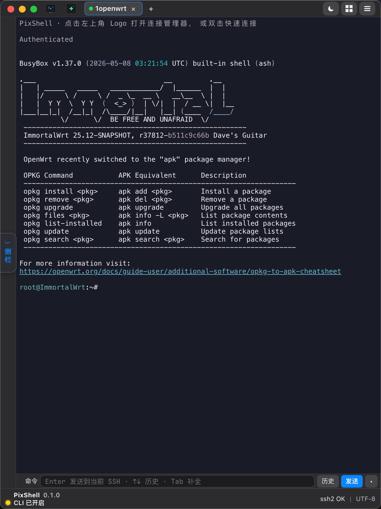
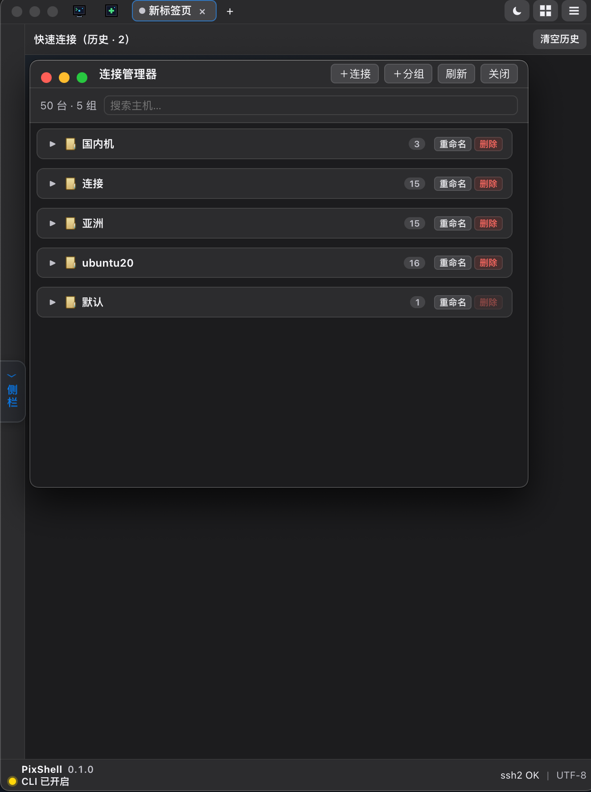
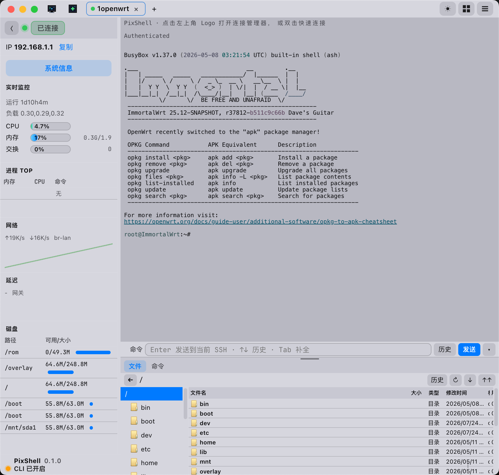
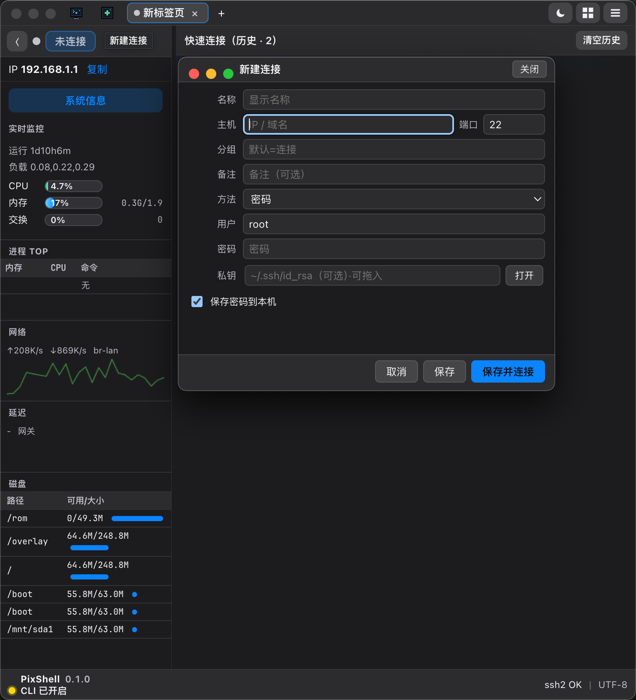
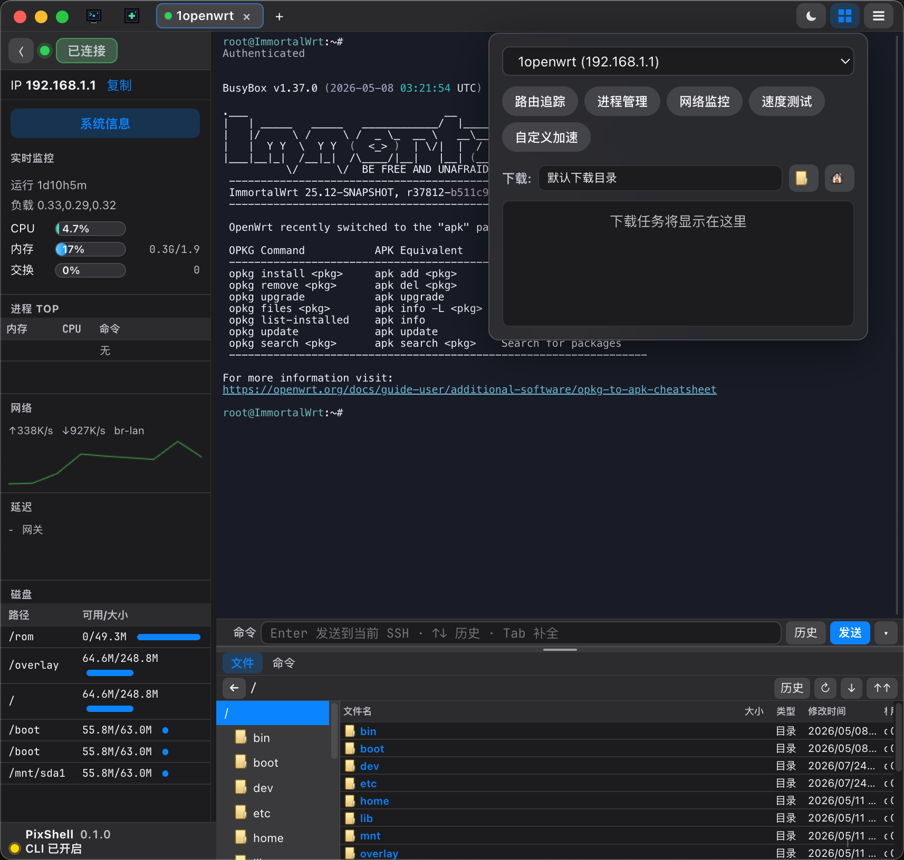
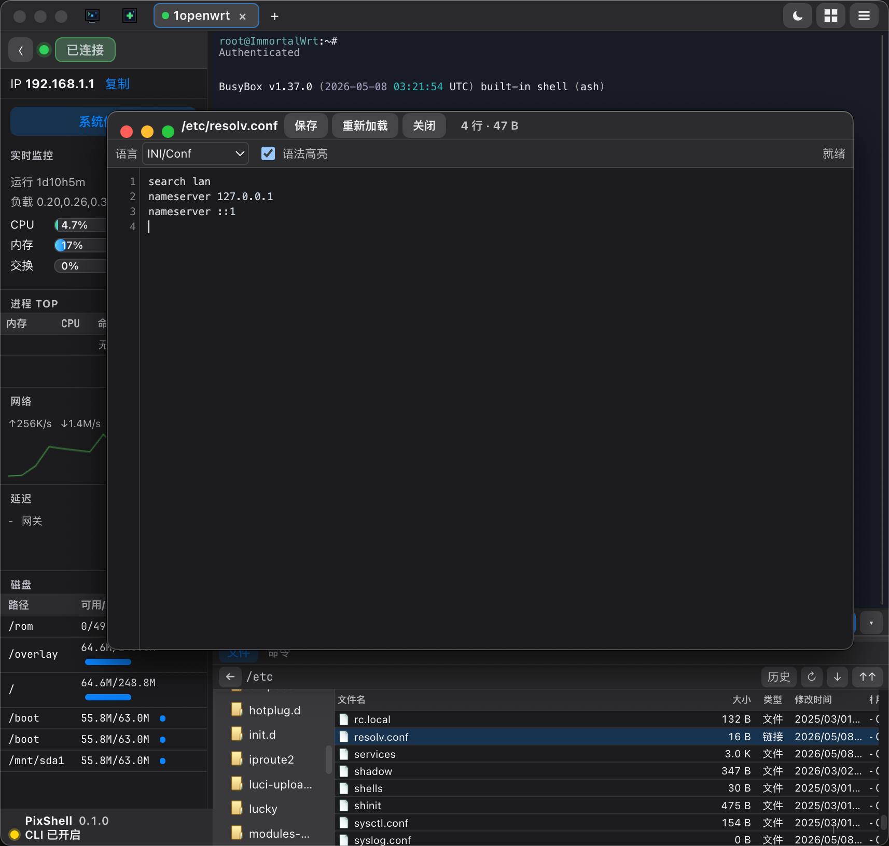

# PixShell


**PixShell** is a cross-platform SSH / SFTP desktop client built with Electron, native `ssh2`, and xterm.

> 中文介绍见下方 [中文](#中文) 章节。

---

## Features

- Multi-session SSH terminal with tabbed workspace
- Connection manager with groups, notes, and host icons
- Password / private-key authentication, optional save password
- SFTP file browser, upload / download, and remote text editor
- Light / dark themes with high-contrast terminal palettes
- Local agent / CLI bridge for automation workflows
- Packaged installers for **macOS** and **Windows** (runtime dependencies bundled)

## Screenshots

| Main Terminal | Connection Manager | Light Theme |
|---|---|---|
|  |  |  |

| New Connection | Transfer | Editor |
|---|---|---|
|  |  |  |

More: [Quick Connect](docs/assets/screenshots/quick-connect.png) · [Collapsed Sidebar](docs/assets/screenshots/main-sidebar-collapsed.png) · [Backup Settings](docs/assets/screenshots/backup-settings.png) · [Terminal Session](docs/assets/screenshots/terminal-session.png)

## Install (packaged app)

Packaged builds already include Electron and required runtime libraries. Users do **not** need to install Node.js separately.

### Windows

- Installer type: NSIS
- Custom install directory is supported
- Desktop / Start Menu shortcuts are created by default

```bash
npm run dist:win
```

### macOS

```bash
npm run dist:mac
```

### Linux

```bash
npm run dist:linux
```

## First-run configuration

User SSH hosts, passwords, settings, and quick commands are **never packaged** into the app.

On first launch, PixShell automatically creates a local config directory and empty defaults.

### Default config paths

| Platform | Path |
|---|---|
| macOS | `~/Library/Application Support/PixShell/pixshell/` |
| Windows | `%APPDATA%\\PixShell\\pixshell\\` |
| Linux | `~/.local/share/PixShell/pixshell/` |

Typical files created at runtime:

- `hosts.json` — saved hosts (mode `0600`; passwords prefer OS secure storage)
- `settings.json` — app preferences
- `quick-commands.json` — quick command library

> Private keys, passwords, known_hosts, and other secrets stay on the local machine only. They are excluded from git and installers.

## Develop from source

Requirements for source development only:

- Node.js **>= 20**
- npm

```bash
npm install
npm start
# or
node start.js
```

CLI helper:

```bash
npm run cli -- --help
```

Unit checks:

```bash
npm test
```

## Project layout

```text
pixshell/
├── packages/app          # Electron main + renderer
├── packages/ssh          # SSH / SFTP session stack
├── packages/*            # monitoring, commands, proxy, transfer...
├── scripts/              # packaging helpers & tests
├── docs/assets           # logo + screenshots
├── build/                # app icons for packaging
├── electron-builder.yml  # macOS / Windows / Linux targets
└── start.js              # launcher
```

## Security notes

- Do not commit `hosts.json`, private keys, or runtime logs
- Packaged builds intentionally omit user configuration
- Config is generated on first run in the platform user-data directory

## License

UNLICENSED / proprietary source unless otherwise stated by the owner.

---

## 中文

**PixShell** 是一款跨平台 SSH / SFTP 桌面客户端，基于 Electron、原生 `ssh2` 与 xterm。

### 功能亮点

- 多标签 SSH 终端工作区
- 连接管理器：分组、备注、主机图标
- 密码 / 私钥登录，可选择保存密码
- SFTP 浏览、上传下载、远程文本编辑
- 浅色 / 深色主题，终端高对比配色
- 本地 Agent / CLI 自动化桥接
- macOS / Windows 安装包内置运行时依赖

### 首次运行与配置路径

安装包**不包含**用户 SSH 配置。首次启动会自动生成配置目录：

| 系统 | 默认路径 |
|---|---|
| macOS | `~/Library/Application Support/PixShell/pixshell/` |
| Windows | `%APPDATA%\\PixShell\\pixshell\\` |
| Linux | `~/.local/share/PixShell/pixshell/` |

运行时生成：

- `hosts.json`
- `settings.json`
- `quick-commands.json`

### Windows 安装

- 使用 NSIS 安装程序
- **支持自定义安装路径**
- 可创建桌面与开始菜单快捷方式

### 从源码开发

```bash
npm install
npm start
```

仅开发源码需要 Node.js >= 20；正式安装包已打包运行时，终端用户无需单独安装依赖。
